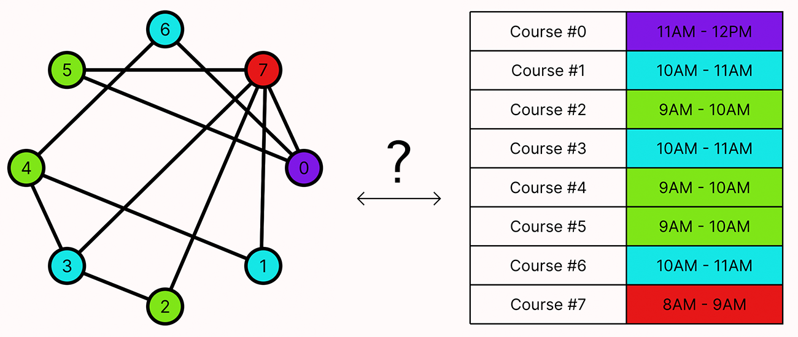
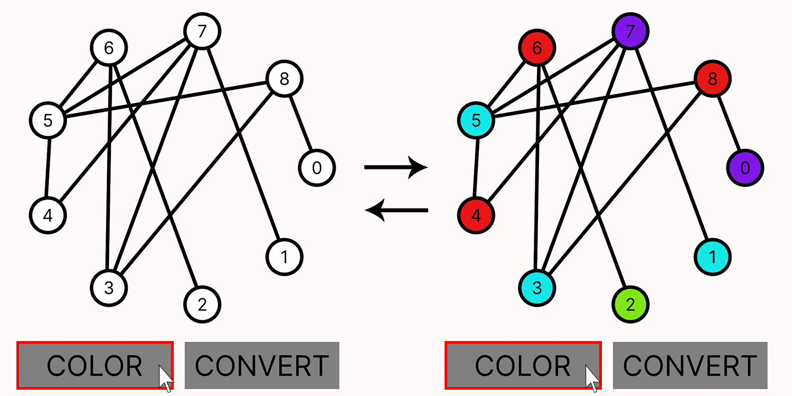
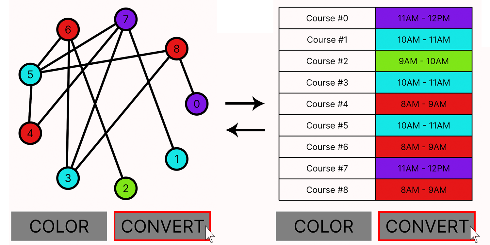

# Colorful Complexity: Graph Coloring in Diverse Domains



## Project Description
> Yeah, #$@! is cool, but have you ever solved a scheduling problem using graph coloring?

Although graph coloring may initially appear to be a purely theoretical problem, it has profound implications in applied fields like operations research and combinatorial optimization. In this project, we explore how the principles of graph coloring are equivalent to, and can be extended to, various practical problems. Specifically, we investigate its application in scheduling, where graph coloring helps in scheduling exams without conflicts, and in constructing Latin squares, which require placing distinct symbols in a grid such that each symbol appears only once per row and column. By examining these equivalences, we aim to enhance the utility of graph coloring properties and demonstrate their broad applicability in solving complex real-world problems.

## Problem Representation
> What tradeoffs did you make in choosing your representation? What else did you try that didn’t work as well?

We start with modeling graph coloring, scheduling and latin squares individually. Our expected solution space is all the possible graph colorings, all the possible scheduling and all the possible solutions to latin squares. 

#### Graph and Coloring Representation

In the midterm project, we represented the graph as a Vertex and a set of other vertices it is adjacent to. We have chosen to keep this characterization.

```
sig Vertex {
  adjacent: set Vertex
}
```

Now that we have a have a working model for a Graph, we can start thinking about how to model the coloring of the graph. We start by defining a set of colors and a function that maps each vertex to a color. To do this, we create a `Coloring` sig with a `pfunc`, as described.

```
sig Color {}

one sig Coloring {
    color: pfunc Vertex -> Color
}
```
#### Scheduling representation

We modelled the scheduling problem similarly to our graph coloring problem.

Our first instinct was to represent a course as a `Course`sig with a set of students represented by the `Student`sig. We planned to model the scheduling problem such that two courses with intersecting set of students could not be assigned to the same time slot represented by the `ExamSlot` sig.

````
sig Student {}
sig ExamSlot {}

sig Course {
    students: set Student
}

````
However, we found this characterization bulky, and for the purposes of the assignment we did not feel that including individual students in the model would not help us achieve our goal. As such, we decided to be rid of the `Student` sig and model a course as:
````
sig Course {
    intersecting: set Course
}
````
In addition, we decided to model a Scheduling by a pfunc from `Courses` to `ExamSlot` so that the overall model structure becomes: 
````
sig ExamSlot {}

sig Course {
    intersecting: set Course
}

sig Scheduling {
    schedule: pfunc Course -> ExamSlot
}
````
Notice how similar the structure is to graph coloring. 

#### Graph-coloring and Scheduling equivalence

Modelling the equivalence was a straightforward process. 

We created a signature called `Equiavlence`with a morphism field representing the relation between courses and vertex. We decided to model the morphism as a relation `set Course -> Vertex` rather than a function or partial function since they have the same underlying structure. It represents an equivalence of constraints on a set of objects.

````
sig Equivalence {
    morphism: set Course -> Vertex
}
````

Moreover, to convert a coloring to a scheduling and vice versa we needed to have a correspondance between colors and exam slots, which is represented by the `SlotColorCorrepondance`signature with a mapping field.

````
sig SlotColorCorrespondance {
    mapping: set ExamSlot -> Color
}
````

## Predicates
> At a high level, what do each of your sigs and preds represent in the context of the model? Justify the purpose for their existence and how they fit together.

#### Graph-coloring predicates

- Our `wellformed_graph` predicate checks that the graph is connected, undirected and has no self loops. Though there exist graph coloring algorithms that work with directed graphs, we thought that undirected graphs were more interesting. Furthermore, we wanted our graphs to be connected, because colorings for disconnected graphs can be reduced to colorings for each connected component of the graph. These are all choices and abstractions that we have built into our model.

- Our `wellformed_colorings` predicate checks that the coloring is valid. This means that no two adjacent vertices share the same color. We also check that the coloring is complete, i.e. every vertex has a color. This is the essence of graph coloring.

When run together, for N vertices and M colors, we get all the possible colorings of graphs with N vertices and M colors. If a graph with N vertices cannot be colored with M colors, we get UNSAT. Sterling gives us a nice visualization.

```
run { 
  wellformed_graph
  wellformed_colorings
} for exactly 3 Vertex, exactly 2 Color, exactly 1 Coloring
```
#### Scheduling predicates

- Our `wellformed_course` predicate checks that a course doesn't intersect with itself, that if courses intersect then they are in each of their intersecting sets, and that all the courses form one inseparable scheduling problem. We wanted all our courses to be connected via the intersected field, because scheduling problems for disjoint sets of courses can be reduced to schedulings for disjoint set of courses. These are all choices and abstractions that we have built into our model.

- Our `wellformed_schedule` predicate checks that the schedule is valid. This means that no two courses that intersect (share students) share the same exam slot. We also check that the scheduling is complete, i.e. every course is assigned an exam slot.

When run together, for N Courses and M ExamSlots, we get all the possible schedulings with N courses and M exam slots. If there is no schedule satisfying a set of N Courses and M ExamSlots, we get UNSAT. Sterling gives us a nice visualization, which is quasi identical to the graph-coloring visualization.

```
run { 
  wellformed_course
  wellformed_schedule
} for exactly 3 Course, exactly 2 ExamSlot, exactly 1 Scheduling
```
#### Equivalence predicates

- Our `ismorphism`predicate enforces that our `Equivalence.morphism` is an isomorphism. This means that it is total, injective, surjective and structure preserving. Hence, it is a one-to-one mapping such that two courses intersect if and only if their respective vertex mappings are connected by an edge. In essence, this isomorphism predicate ensures that we can get a one-to-one mapping from a scheduling problem to a graph coloring problem while exactly preserving the existing constraints. Moreover, since this is a one-to-one morphism, it can be inverted to be an isomorphism from a graph coloring problem to a scheduling problem!

- Our `SlotColorCorrespondance` predicate enforces that our `SlotColorCorrespondance.mapping` is bijective. This means that it is total, injective and surjective. It established a one-to-one (so invertible) correspondance between colors and exam slots, which will be crucial in translating a graph coloring into a course scheduling and vice versa

- Our `concat_is_wellformed_coloring[relation: set Vertex -> Color]` predicate evaluates whether the given relation represents a wellformed coloring as defined in the graph-coloring section. It is essential to our property testing section.

- Our `concat_is_wellformed_scheduling[relation: set Course -> ExamSlot]` predicate evaluates whether the given relation represents a wellformed schedule as defined in the scheduling section. It is essential to our property testing section.

## Verification
>What tests did you write to test your model itself? What tests did you write to verify properties about your domain area?

#### Model tests 

We wrote tests to check for over constraint and under constraint for all our models. We transfered over our graph coloring tests from the midterm project since the graph coloring section was unchanged. All the tests are in the files `coloring.tests.frg`, `scheduling.tests.frg` and `equivalence.tests.frg`. 

#### Property tests

The main goal of this project is to prove that graph coloring and scheduling problems were equivalent. This is particularly well illustrated by the visualization. We did so in three steps:

1. We proved that if we have a wellformed graph and an isomorphism between a graph and a set of intersecting courses, then the courses must also be wellformed. Conversely, we proved that if we have a wellformed set of intersecting courses and an isomorphism between a graph and a set of intersecting courses, then the graph must also be wellformed. This verifies that there is a bijection bewteen the constraints of each problem.

2. We proved that if a wellformed graph has a valid coloring and there is an isomorphism between the graph and a set of intersecting courses, then the courses have a valid schduling. Conversely, we proved that if a wellformed set of intersecting courses has a valid scheduling and there is an isomorphism between the courses and a graph, then the graph has a valid coloring.

3. We proved that given a wellformed graph, a valid coloring and an isomorphism between the graph and a set of intersecting courses, we can construct a valid scheduling for the courses. Conversely, we proved that given a wellformed set of intersecting courses, a valid scheduling and an isomorphism between the graph and a set of intersecting courses, we can construct a valid coloring for the graph.

In addition, we tested a few miscellaneous properties of isomorphisms and correspondance relating to cardinality, empty sets and sets with one element. 

## Visualization
> How should we understand an instance of your model and what your visualization shows (whether custom or default)?

To run the visualization:
1. Adjust the parameters (number of nodes, colors) at the bottom of the `coloring.frg` file and click the green run button.
2. When Sterling opens, copy-paste the contents of `vis.js` into the Script tab, under the \<svg> option and click the blue "Run" button in the top right corner.

You now have two buttons you can click on. Click on `COLOR` to see the coloring of the graph and click on `CONVERT` to see the equivalent scheduling problem. These buttons are toggle-able (you can switch between the views by clicking on them again).



Here we have a plain graph-coloring. The nodes are colored in such a way that no two adjacent nodes (nodes that have an edge between them) have the same color. The graph is placed in a circular pattern and colors are generated evenly on the color-wheel for an arbitrary number of nodes.



We then consider an equivalent scheduling problem where:
- A course is represented by a vertex (e.g. a vertex with label "1" represents Course #1, etc.)
- Each edge represents whether there exists a student that is taking both courses that the edge connects
- A unique color represents a unique time-slot.

Coloring the graph in such a way that no two adjacent nodes have the same color is then equivalent to scheduling exams in such a way that no student has two exams at the same time. The visualization generates some arbitrary but realistic time-slots per color and shows a timetable that is valid for the courses.

## Exploratory work

Scheduling is not the only problem that can be translated into graph coloring, and we explored a few alternatives. At first, we wanted to model Sudoku, but quickly found that we were limited by Forge's expressive power. Therefore, we limited ourselves to latin squares, a precursor to sudoku. 

A Latin square is an n*n grid that must be completed with n elements so that every elmement appears exactly once in every row and every column. 

We did not prove that solving a latin square can be reduced to coloring a specific graph, but we implemented a few constraints on graphs in the `latinsquare.frg` file that would force a graph to represent 3*3 or 4*4 latin squares. 

Note that unlike the scheduling problem, solving latin squares and coloring graphs are not equivalent problems. From every matin square we can make a graph, but the converse isn't true. 

## Collaborators and Sharing
© Komron Aripov, Mathilde Kermorgant, and Sahdiah Cox

